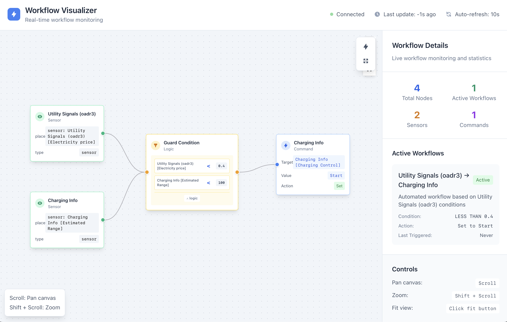

# AI Workflow

## llama.cpp compile and build
1. Download llama.cpp
2. Go to the directory and do as per one of the options below:

### No GPU
```shell
cmake -B build.blis -DGGML_BLAS=on -DGGML_BLAS_VENDOR=FLAME
```
followed by
```shell
cmake --build build.blis --conifg release
```
This will install llama.cpp binaries in build.blis directory local to llama.cpp installation. The reason we are using build.blis directory is that you may want to experiment with the GPU version

### Nvidia GPU
On Ubuntu:
```shell
sudo ubuntu-drivers install
sudo apt install nvidia-utils-{latest version}
sudo apt install nvidia-cuda-toolkit
```
Now you are ready to build:
```shell
cmake -B build.cuda -DGGML_CUDA=on 
```
followed by
```shell
cmake --build build.cuda --config release
```
If you have x running, you may want to have it release resources. First use nvidia-smi utility to see what's running and how much memory is being used by other things:
```shell
sudo nvidia-smi
```
if anything is running and using memory:
1. Make the prime display point to the integrated one (say intel)
```shell
sudo prime-select intel
```
2. Then, make it on demand
```shell
sudo prime-select on-demand
```
3. Make sure your system sees it:
```shell
nvidia-smi
```

## Goal

This library goal is to convert a user query written in natural language to programs for IoX systems.

## Quick start

Installation:

```shell
git clone https://github.com/NuCoreAI/ai-workflow.git
cd ai-workflow
make setup
```

Now, you need 2 models using the GGUF format (llama.cpp):

- A large language model (for instance llama-3.1-8b you can find [here](https://huggingface.co/lmstudio-community/Meta-Llama-3.1-8B-Instruct-GGUF))
- A re-ranker model (for instance bge-reranker-v2-m3 you can find [here](https://huggingface.co/gpustack/bge-reranker-v2-m3-GGUF))


For the next part you need:

- a IoX profile using the JSON format
- a XML export of the IoX nodes

```python
python3 -m ai_iox_workflow.cli \
  --workflow-llm-model llama-3.1-8b \
  --profile profile.json \
  --nodes nodes.xml \
  "If the electricity price is above 0.4$, stop charging the car"
```

Example response:

```plain
Identifying relevant nodes...
Found:
- sensor: Utility Signals (oadr3) [Electricity price]
- sensor: Charging Info [Estimated Range]
- sensor: Charging Info [Charge energy added]
- sensor: Charging Info [Charger voltage]
- sensor: Charging Info [Last Command Status]
- sensor: Charging Info [Charging Requested]
- sensor: Charging Info [Charging Power]
- command: Charging Info [Charging Control]
- command: Charging Info [Set Max Charge Current]
- command: Charging Info [Charge Port Control]
Building workflow...
================================================================================
Workflow Details:
Transition:
  Guard:
    Conditions: AND
      - Utility Signals (oadr3) [Electricity price] GREATER THAN ITokenValue(value=0.4)
  Output:
    Set Charging Info [Charging Control] to Stop
================================================================================
JSON Representation
{
  "transition": {
    "inputs": [
      {
        "place": "sensor: Utility Signals (oadr3) [Electricity price]"
      }
    ],
    "guard": {
      "conditions": [
        {
          "place_state": {
            "place": "Utility Signals (oadr3) [Electricity price]",
            "operator": "GREATER THAN",
            "value": {
              "value": 0.4
            }
          }
        }
      ],
      "conditions_operator": "AND"
    },
    "output": {
      "place": "command: Charging Info [Charging Control]",
      "token_produced": {
        "set_value": "Charging Info [Charging Control]",
        "to": {
          "value": "Stop"
        }
      }
    }
  }
}
```

## Using the UI

First install dependencies:

```shell
cd ui/
npm i

# then launch the dev server:

npx vite dev

# browse to http://localhost:5173/
```

Then generate a workflow with `--output-workflow`

```shell
python3 -m ai_iox_workflow.cli \
    --workflow-llm-model qwen3-1.7b \
    --profile profile.json \
    --nodes nodes.xml \
    --output-workflow ui/client/public/assets/workflow.json \
    "If the electricity price is lower than 0.4 and the remaining range of the car is under 100 miles, charge the car"
```



## Workflow schema

See the [Workflow, Transition, Place, TokenType classes in models.py from llm-tap](https://github.com/advanced-stack/llm-tap/blob/main/src/llm_tap/models.py)

## CLI

```shell
python3 -m ai_iox_workflow.cli -h

usage: cli.py [-h] --profile PROFILE --nodes NODES [--workflow-llm-model WORKFLOW_LLM_MODEL]
              [--reranker-model RERANKER_MODEL]
              query

Generate an AI workflow based on a query.

positional arguments:
  query                 The query to generate the workflow from.

options:
  -h, --help            show this help message and exit
  --profile PROFILE     Path to the profile JSON file.
  --nodes NODES         Path to the nodes XML file.
  --workflow-llm-model WORKFLOW_LLM_MODEL
                        Accepts any GGUF LLM models
  --reranker-model RERANKER_MODEL
                        Accepts GGUF re-ranking models. Qwen3 reranking is *not* yet supported by llama.cpp.
```


## Example queries

1. "Turn on the fan when the temperature exceeds 30°C in the office."
2. "If the electricity price is below 0.5$, start charging the car."
3. "Set the thermostat to cooling mode if the room temperature is above 75°F."
4. "Activate the siren when the door is forced open."
5. "Change the light color to blue when it's cloudy outside."
6. "Stop playing music on the AudioPlayer if Bluetooth service is disabled."
7. "Turn off the lights when the room occupancy is 'Away'."
8. "Start the fan for 10 minutes if the humidity is above 70%."
9. "Dim the lights to 50% when it's nighttime."
10. "Increase the thermostat heat setpoint by 2°C when the weather is cold."
11. "Stop charging the electric vehicle if the battery percentage reaches 80%."
12. "Enable Weather updates when it's enabled in the system."
13. "Unlock the front door when security mode is disarmed."
14. "Close the charge port if the EV battery is full."
15. "Turn off the relay if the price of electricity exceeds $1.2 per kWh."
16. "Start the audio playback on the speaker if Bluetooth is paired."
17. "Turn off all lights if any light's status is 'Off'."
18. "Activate the dehumidifier when indoor humidity exceeds 60%."
19. "If the air quality score is poor, adjust the HVAC system to improve air quality."
20. "Play a sound notification on the AudioPlayer when the door is opened."


To run the example queries and store each result in a dedicated text file, you can use the following commands:

```shell
./run-examples.sh
```
